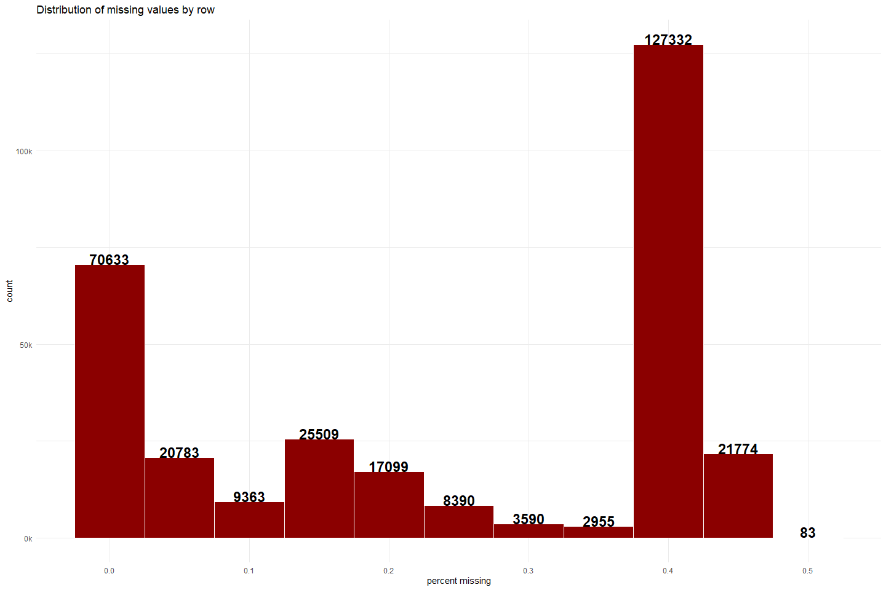

# Initial setup

> Load packages and data, define custom functions


```r
# Load packages ----
library(lemon)
library(ggforce) 
library(concaveman)
library(matrixStats) 
library(dplyr)
library(rlang)
library(e1071)
library(stringi)
library(rcompanion)
library(lubridate)
library(magrittr)
library(zoo)
library(tidyverse)
library(xlsx)
library(openxlsx)
library(DBI)
library(readxl)
library(ggrepel)
library(plotly)
library(tidyxl)
library(scales)
library(patchwork)
library(GGally)
library(caret)

# Set options ----
options(tibble.print_max = 40,
        tibble.print_min = 24,
        width = 100,
        pillar.min_title_chars = 15)

# Custom functions/values ----
# __ given a vector, "outlying" values >(<) 3rd(1st) quartile +(-) 1.5IQR
soutlier <- function(x, lower = FALSE){
  if (lower){
    -(IQR(x, na.rm = TRUE) * 1.5) + quantile(x, names = FALSE, na.rm = TRUE)[2]
  } else {
    (IQR(x, na.rm = TRUE) * 1.5) + quantile(x, names = FALSE, na.rm = TRUE)[4]
  }
}

# Load data, set column names to lower case ----
app_test <- read_csv("../data/application_test.csv") %>%
  rename_with(~tolower(.))
app_train <- read_csv("../data/application_train.csv") %>%
  rename_with(~tolower(.))
bur <- read_csv("../data/bureau.csv") %>%
  rename_with(~tolower(.))
bur_bal <- read_csv("../data/bureau_balance.csv") %>%
  rename_with(~tolower(.))
ccb <- read_csv("../data/credit_card_balance.csv") %>%
  rename_with(~tolower(.))
inst_pay <- read_csv("../data/installments_payments.csv") %>%
  rename_with(~tolower(.))
pos_cash <- read_csv("../data/POS_CASH_balance.csv") %>%
  rename_with(~tolower(.))
prev_app <- read_csv("../data/previous_application.csv") %>%
  rename_with(~tolower(.))
table_desc <- read_csv(paste0("../data/HomeCredit_columns_description.csv")) %>%
  rename_with(~tolower(.))
```

# Basic inspection of application train data


```r
# app_train %>%
#   mutate(target = factor(target, levels = c(0, 1)),
#          across(where(is.character), ~factor(., levels = unique(.)[order(unique(.))]))) %>%
#   summary(maxsum = 20)
```

## Class proportions of target variable


```r
table(app_train$target)
```

```
## 
##      0      1 
## 282686  24825
```

```r
table(app_train$target) %>% 
  prop.table() %>% 
  round(3)
```

```
## 
##     0     1 
## 0.919 0.081
```
Only 8.1% of individuals in train set experience payment difficulties. In other words, the no-information rate is 92% which means model accuracy will need to exceed that in order to be meaningful/useful. Special attention should also be given to model Sensitivity and Specificity. 

## Scope of missing values

### Rowwise completeness 


```r
app_train %>%
  mutate(n_missing = rowSums(is.na(.)),
         p_missing = n_missing/ncol(.)) %>%
  ggplot() +
  geom_histogram(aes(p_missing),
                 binwidth = 0.05, fill = "darkred", color = "white") +
  stat_bin(aes(p_missing, y = after_stat(count), label = ifelse(after_stat(count) == 0, "", after_stat(count))),
           geom = "text", binwidth = 0.05, size = 6, fontface = "bold", vjust = 0) +
  scale_x_continuous(breaks = seq(0,1,0.1), minor_breaks = NULL) +
  scale_y_continuous(labels = ~paste0(.%/%1000, "k")) +
  labs(title = "Distribution of missing values by row",
       x = "percent missing") +
  theme_minimal()
```

<!-- -->


### Columns with most NA's


```r
app_train %>%
  summarise(across(everything(), ~sum(is.na(.)))) %>%
  pivot_longer(everything(),
               names_to = "col",
               values_to = "n_missing") %>%
  mutate(p_missing = percent(n_missing / nrow(app_train), 0.1)) %>%
  arrange(-n_missing) %>%
  head(20)
```

```
## # A tibble: 20 × 3
##    col                      n_missing p_missing
##    <chr>                        <int> <chr>    
##  1 commonarea_avg              214865 69.9%    
##  2 commonarea_mode             214865 69.9%    
##  3 commonarea_medi             214865 69.9%    
##  4 nonlivingapartments_avg     213514 69.4%    
##  5 nonlivingapartments_mode    213514 69.4%    
##  6 nonlivingapartments_medi    213514 69.4%    
##  7 fondkapremont_mode          210295 68.4%    
##  8 livingapartments_avg        210199 68.4%    
##  9 livingapartments_mode       210199 68.4%    
## 10 livingapartments_medi       210199 68.4%    
## 11 floorsmin_avg               208642 67.8%    
## 12 floorsmin_mode              208642 67.8%    
## 13 floorsmin_medi              208642 67.8%    
## 14 years_build_avg             204488 66.5%    
## 15 years_build_mode            204488 66.5%    
## 16 years_build_medi            204488 66.5%    
## 17 own_car_age                 202929 66.0%    
## 18 landarea_avg                182590 59.4%    
## 19 landarea_mode               182590 59.4%    
## 20 landarea_medi               182590 59.4%
```


## Inspecting numerical variables

### Class conversion

There are many categorical variables in this table which are encoded numerically. With 122 total columns, it's rather arduous to distinguish true numerical variables but selecting columns that only contain numbers (and NA's) is an obvious start.


```r
# Ensuring data types were properly attributed during import
app_train %>%
  summarise(across(everything(), 
                   list(assigned = class,
                        observed = \(xx){
                          case_when(grepl("^(\\d|\\.|-)+$", xx) | is.na(xx) ~ "numeric", 
                                    .default = "character")
                        },
                        # get example of value
                        vsample = ~as.character(.))) %>% 
            first) %>%
  # convert to long form
  pivot_longer(everything(),
               names_to = c("column", ".value"),
               names_pattern = "(.*)_(.*)") 
```

```
## # A tibble: 122 × 4
##    column                     assigned  observed  vsample                      
##    <chr>                      <chr>     <chr>     <chr>                        
##  1 sk_id_curr                 numeric   numeric   100002                       
##  2 target                     numeric   numeric   1                            
##  3 name_contract_type         character character Cash loans                   
##  4 code_gender                character character M                            
##  5 flag_own_car               character character N                            
##  6 flag_own_realty            character character Y                            
##  7 cnt_children               numeric   numeric   0                            
##  8 amt_income_total           numeric   numeric   202500                       
##  9 amt_credit                 numeric   numeric   406597.5                     
## 10 amt_annuity                numeric   numeric   24700.5                      
## 11 amt_goods_price            numeric   numeric   351000                       
## 12 name_type_suite            character character Unaccompanied                
## 13 name_income_type           character character Working                      
## 14 name_education_type        character character Secondary / secondary special
## 15 name_family_status         character character Single / not married         
## 16 name_housing_type          character character House / apartment            
## 17 region_population_relative numeric   numeric   0.018801                     
## 18 days_birth                 numeric   numeric   -9461                        
## 19 days_employed              numeric   numeric   -637                         
## 20 days_registration          numeric   numeric   -3648                        
## 21 days_id_publish            numeric   numeric   -2120                        
## 22 own_car_age                numeric   numeric   <NA>                         
## 23 flag_mobil                 numeric   numeric   1                            
## 24 flag_emp_phone             numeric   numeric   1                            
## # ℹ 98 more rows
```

```r
# Subset mismatches
app_train %>%
  summarise(across(everything(), 
                   list(assigned = class,
                        observed = \(xx){
                          case_when(grepl("^(\\d|\\.|-)+$", xx) | is.na(xx) ~ "numeric", 
                                    .default = "character")
                        },
                        vsample = ~as.character(.))) %>%
            first) %>%
  pivot_longer(everything(),
               names_to = c("column", ".value"),
               names_pattern = "(.*)_(.*)") %>%
  filter(assigned != observed) 
```

```
## # A tibble: 0 × 4
## # ℹ 4 variables: column <chr>, assigned <chr>, observed <chr>, vsample <chr>
```

Since no columns where misclassed during the importing process, we can move on to subsetting the numerical columns.


```r
app_train %>%
  select(where(is.numeric))
```

```
## # A tibble: 307,511 × 106
##    sk_id_curr target cnt_children amt_income_total amt_credit amt_annuity amt_goods_price
##         <dbl>  <dbl>        <dbl>            <dbl>      <dbl>       <dbl>           <dbl>
##  1     100002      1            0          202500     406598.      24700.          351000
##  2     100003      0            0          270000    1293502.      35698.         1129500
##  3     100004      0            0           67500     135000        6750           135000
##  4     100006      0            0          135000     312682.      29686.          297000
##  5     100007      0            0          121500     513000       21866.          513000
##  6     100008      0            0           99000     490496.      27518.          454500
##  7     100009      0            1          171000    1560726       41301          1395000
##  8     100010      0            0          360000    1530000       42075          1530000
##  9     100011      0            0          112500    1019610       33826.          913500
## 10     100012      0            0          135000     405000       20250           405000
## 11     100014      0            1          112500     652500       21177           652500
## 12     100015      0            0           38419.    148365       10678.          135000
## 13     100016      0            0           67500      80865        5882.           67500
## 14     100017      0            1          225000     918468       28966.          697500
## 15     100018      0            0          189000     773680.      32778           679500
## 16     100019      0            0          157500     299772       20160           247500
## 17     100020      0            0          108000     509602.      26150.          387000
## 18     100021      0            1           81000     270000       13500           270000
## 19     100022      0            0          112500     157500        7875           157500
## 20     100023      0            1           90000     544491       17564.          454500
## 21     100024      0            0          135000     427500       21375           427500
## 22     100025      0            1          202500    1132574.      37562.          927000
## 23     100026      0            1          450000     497520       32522.          450000
## 24     100027      0            0           83250     239850       23850           225000
## # ℹ 307,487 more rows
## # ℹ 99 more variables: region_population_relative <dbl>, days_birth <dbl>, days_employed <dbl>,
## #   days_registration <dbl>, days_id_publish <dbl>, own_car_age <dbl>, flag_mobil <dbl>,
## #   flag_emp_phone <dbl>, flag_work_phone <dbl>, flag_cont_mobile <dbl>, flag_phone <dbl>,
## #   flag_email <dbl>, cnt_fam_members <dbl>, region_rating_client <dbl>,
## #   region_rating_client_w_city <dbl>, hour_appr_process_start <dbl>,
## #   reg_region_not_live_region <dbl>, reg_region_not_work_region <dbl>, …
```

106/122 (87%) of columns in the train set are classified as numeric so this subsetting didn't do much for us. It's unlikely that categorical variables would be encoded with decimals/doubles or negative numbers, so we can remove these for now while we look through the rest of the variables' description in the column description file.


```r
app_train %>%
  # Keep only numeric columns
  select(where(is.numeric)) %>%
  # Convert everytyhing to character
  mutate(across(everything(), as.character)) %>%
  # Only keep rows without negatives or decimals
  select(where(~ all(!grepl("\\.|-", .)))) %>%
  colnames() %>%
  tibble(column = .)
```

```
## # A tibble: 50 × 1
##    column                     
##    <chr>                      
##  1 sk_id_curr                 
##  2 target                     
##  3 cnt_children               
##  4 own_car_age                
##  5 flag_mobil                 
##  6 flag_emp_phone             
##  7 flag_work_phone            
##  8 flag_cont_mobile           
##  9 flag_phone                 
## 10 flag_email                 
## 11 cnt_fam_members            
## 12 region_rating_client       
## 13 region_rating_client_w_city
## 14 hour_appr_process_start    
## 15 reg_region_not_live_region 
## 16 reg_region_not_work_region 
## 17 live_region_not_work_region
## 18 reg_city_not_live_city     
## 19 reg_city_not_work_city     
## 20 live_city_not_work_city    
## 21 obs_30_cnt_social_circle   
## 22 def_30_cnt_social_circle   
## 23 obs_60_cnt_social_circle   
## 24 def_60_cnt_social_circle   
## # ℹ 26 more rows
```

This brings us down to a much more manageable 50 columns. Further determination can be aided by the column description file. Once all categorical variables have been identified, they can be converted to factors. The new factors can easily be reconverted later if need be.


```r
num2fac <- app_train %>%
  select(where(is.numeric)) %>%
  mutate(across(everything(), as.character)) %>%
  select(where(~ all(!grepl("\\.|-", .)))) %>%
  select(-c(own_car_age, hour_appr_process_start, matches("^(obs|def|cnt)"))) %>%
  colnames() 

app_train1 <- app_train %>%
  mutate(across(c(where(is.character), all_of(num2fac)), factor)) 
```

### Distribution and other characteristics


```r
app_train1 %>%
  select(where(is.numeric)) %>%
  summarise(across(everything(), 
                   list(avg = ~mean(., na.rm = TRUE),
                        med = ~median(., na.rm = TRUE),
                        max = ~max(., na.rm = TRUE),
                        min = ~min(., na.rm = TRUE),
                        sd = ~sd(., na.rm = TRUE),
                        var = ~var(., na.rm = TRUE),
                        outupper = ~soutlier(.), # upper outlying level
                        outlower = ~soutlier(., lower = TRUE))) %>% # lower outlying level
              round(2)) %>%
  pivot_longer(everything(),
               names_to = c("column", ".value"),
               names_pattern = "(.*)_(.*)")
```

```
## # A tibble: 64 × 9
##    column                          avg      med      max      min      sd      var outupper outlower
##    <chr>                         <dbl>    <dbl>    <dbl>    <dbl>   <dbl>    <dbl>    <dbl>    <dbl>
##  1 cnt_children                4.2 e-1  0        1.9 e+1  0       7.2 e-1 5.2 e- 1  2.5 e+0 -1.5 e+0
##  2 amt_income_total            1.69e+5  1.47e+5  1.17e+8  2.57e+4 2.37e+5 5.62e+10  3.38e+5 -2.25e+4
##  3 amt_credit                  5.99e+5  5.14e+5  4.05e+6  4.50e+4 4.02e+5 1.62e+11  1.62e+6 -5.38e+5
##  4 amt_annuity                 2.71e+4  2.49e+4  2.58e+5  1.62e+3 1.45e+4 2.10e+ 8  6.17e+4 -1.06e+4
##  5 amt_goods_price             5.38e+5  4.50e+5  4.05e+6  4.05e+4 3.69e+5 1.36e+11  1.34e+6 -4.23e+5
##  6 region_population_relative  2   e-2  2   e-2  7   e-2  0       1   e-2 0         6   e-2 -2   e-2
##  7 days_birth                 -1.60e+4 -1.58e+4 -7.49e+3 -2.52e+4 4.36e+3 1.90e+ 7 -1.51e+3 -3.06e+4
##  8 days_employed               6.38e+4 -1.21e+3  3.65e+5 -1.79e+4 1.41e+5 2.00e+10  3.42e+3 -6.47e+3
##  9 days_registration          -4.99e+3 -4.50e+3  0       -2.47e+4 3.52e+3 1.24e+ 7  6.19e+3 -1.57e+4
## 10 days_id_publish            -2.99e+3 -3.25e+3  0       -7.20e+3 1.51e+3 2.28e+ 6  2.15e+3 -8.17e+3
## 11 own_car_age                 1.21e+1  9   e+0  9.1 e+1  0       1.19e+1 1.43e+ 2  3   e+1 -1   e+1
## 12 cnt_fam_members             2.15e+0  2   e+0  2   e+1  1   e+0 9.1 e-1 8.3 e- 1  4.5 e+0  5   e-1
## 13 hour_appr_process_start     1.21e+1  1.2 e+1  2.3 e+1  0       3.27e+0 1.07e+ 1  2   e+1  4   e+0
## 14 ext_source_1                5   e-1  5.1 e-1  9.6 e-1  1   e-2 2.1 e-1 4   e- 2  1.19e+0 -1.8 e-1
## 15 ext_source_2                5.1 e-1  5.7 e-1  8.5 e-1  0       1.9 e-1 4   e- 2  1.07e+0 -1   e-2
## 16 ext_source_3                5.1 e-1  5.4 e-1  9   e-1  0       1.9 e-1 4   e- 2  1.12e+0 -8   e-2
## 17 apartments_avg              1.2 e-1  9   e-2  1   e+0  0       1.1 e-1 1   e- 2  2.8 e-1 -8   e-2
## 18 basementarea_avg            9   e-2  8   e-2  1   e+0  0       8   e-2 1   e- 2  2.1 e-1 -6   e-2
## 19 years_beginexpluatation_a…  9.8 e-1  9.8 e-1  1   e+0  0       6   e-2 0         1   e+0  9.6 e-1
## 20 years_build_avg             7.5 e-1  7.6 e-1  1   e+0  0       1.1 e-1 1   e- 2  1.03e+0  4.8 e-1
## 21 commonarea_avg              4   e-2  2   e-2  1   e+0  0       8   e-2 1   e- 2  1.2 e-1 -6   e-2
## 22 elevators_avg               8   e-2  0        1   e+0  0       1.3 e-1 2   e- 2  3   e-1 -1.8 e-1
## 23 entrances_avg               1.5 e-1  1.4 e-1  1   e+0  0       1   e-1 1   e- 2  4.1 e-1 -1.4 e-1
## 24 floorsmax_avg               2.3 e-1  1.7 e-1  1   e+0  0       1.4 e-1 2   e- 2  5.8 e-1 -8   e-2
## # ℹ 40 more rows
```


# Addressing problematic columns

Some missing values in `code_gender` and `organization_type` were encoded with the string `XNA` instead of being explicitly missing. 


```r
unique(app_train1$code_gender)
```

```
## [1] M   F   XNA
## Levels: F M XNA
```

```r
unique(app_train1$organization_type)
```

```
##  [1] Business Entity Type 3 School                 Government             Religion              
##  [5] Other                  XNA                    Electricity            Medicine              
##  [9] Business Entity Type 2 Self-employed          Transport: type 2      Construction          
## [13] Housing                Kindergarten           Trade: type 7          Industry: type 11     
## [17] Military               Services               Security Ministries    Transport: type 4     
## [21] Industry: type 1       Emergency              Security               Trade: type 2         
## [25] University             Transport: type 3      Police                 Business Entity Type 1
## [29] Postal                 Industry: type 4       Agriculture            Restaurant            
## [33] Culture                Hotel                  Industry: type 7       Trade: type 3         
## [37] Industry: type 3       Bank                   Industry: type 9       Insurance             
## [41] Trade: type 6          Industry: type 2       Transport: type 1      Industry: type 12     
## [45] Mobile                 Trade: type 1          Industry: type 5       Industry: type 10     
## [49] Legal Services         Advertising            Trade: type 5          Cleaning              
## [53] Industry: type 13      Trade: type 4          Telecom                Industry: type 8      
## [57] Realtor                Industry: type 6      
## 58 Levels: Advertising Agriculture Bank Business Entity Type 1 ... XNA
```

This can be fixed with the following:


```r
app_train1 %>%
  select(code_gender, organization_type) %>%
  mutate(across(c(code_gender, organization_type), 
                ~case_when(. != "XNA" ~ .))) %>% # Fix occurs here
  sapply(., unique) %>% # Displaying the results 
  tibble(cols = names(.),
         val = .) %>%
  unnest(val) %>%
  arrange()
```

```
## # A tibble: 61 × 2
##    cols              val                   
##    <chr>             <fct>                 
##  1 code_gender       M                     
##  2 code_gender       F                     
##  3 code_gender       <NA>                  
##  4 organization_type Business Entity Type 3
##  5 organization_type School                
##  6 organization_type Government            
##  7 organization_type Religion              
##  8 organization_type Other                 
##  9 organization_type <NA>                  
## 10 organization_type Electricity           
## 11 organization_type Medicine              
## 12 organization_type Business Entity Type 2
## 13 organization_type Self-employed         
## 14 organization_type Transport: type 2     
## 15 organization_type Construction          
## 16 organization_type Housing               
## 17 organization_type Kindergarten          
## 18 organization_type Trade: type 7         
## 19 organization_type Industry: type 11     
## 20 organization_type Military              
## 21 organization_type Services              
## 22 organization_type Security Ministries   
## 23 organization_type Transport: type 4     
## 24 organization_type Industry: type 1      
## # ℹ 37 more rows
```
`days_employed` contains some erroneous values. Most values of `days_employed` are negative and yield reasonable values when converted to positive years with $\left( x \div 365 \right) \times -1$ but those beginning > 0 equate to less than -1,000 years. What's more is that all of the values greater than 0 equal 365243. It's possible that this number may be used as a factor to calculate time or define a time interval. 365 (days) 24 (hours) 3 (?) is rather coincidental.


```r
# Maximum is extremely large and mean is greater than 3rd quartile
app_train1$days_employed %>%
  summary
```

```
##    Min. 1st Qu.  Median    Mean 3rd Qu.    Max. 
##  -17912   -2760   -1213   63815    -289  365243
```

```r
# All values > 0 equal 365243
app_train1 %>%
  filter(days_employed > 0) %>%
  select(days_employed) %>%
  summary
```

```
##  days_employed   
##  Min.   :365243  
##  1st Qu.:365243  
##  Median :365243  
##  Mean   :365243  
##  3rd Qu.:365243  
##  Max.   :365243
```

```r
# days_employed converted to years
app_train1 %>%
  select(days_employed) %>%
  mutate(year_conv = round((days_employed / 365) * -1, 2)) %>%
  head(10)
```

```
## # A tibble: 10 × 2
##    days_employed year_conv
##            <dbl>     <dbl>
##  1          -637      1.75
##  2         -1188      3.25
##  3          -225      0.62
##  4         -3039      8.33
##  5         -3038      8.32
##  6         -1588      4.35
##  7         -3130      8.58
##  8          -449      1.23
##  9        365243  -1001.  
## 10         -2019      5.53
```

This can be solved with the following:


```r
app_train1 %>%
  mutate(days_employed = case_when(days_employed <= 0 ~ days_employed))
```

```
## # A tibble: 307,511 × 122
##    sk_id_curr target name_contract_type code_gender flag_own_car flag_own_realty cnt_children
##    <fct>      <fct>  <fct>              <fct>       <fct>        <fct>                  <dbl>
##  1 100002     1      Cash loans         M           N            Y                          0
##  2 100003     0      Cash loans         F           N            N                          0
##  3 100004     0      Revolving loans    M           Y            Y                          0
##  4 100006     0      Cash loans         F           N            Y                          0
##  5 100007     0      Cash loans         M           N            Y                          0
##  6 100008     0      Cash loans         M           N            Y                          0
##  7 100009     0      Cash loans         F           Y            Y                          1
##  8 100010     0      Cash loans         M           Y            Y                          0
##  9 100011     0      Cash loans         F           N            Y                          0
## 10 100012     0      Revolving loans    M           N            Y                          0
## 11 100014     0      Cash loans         F           N            Y                          1
## 12 100015     0      Cash loans         F           N            Y                          0
## 13 100016     0      Cash loans         F           N            Y                          0
## 14 100017     0      Cash loans         M           Y            N                          1
## 15 100018     0      Cash loans         F           N            Y                          0
## 16 100019     0      Cash loans         M           Y            Y                          0
## 17 100020     0      Cash loans         M           N            N                          0
## 18 100021     0      Revolving loans    F           N            Y                          1
## 19 100022     0      Revolving loans    F           N            Y                          0
## 20 100023     0      Cash loans         F           N            Y                          1
## 21 100024     0      Revolving loans    M           Y            Y                          0
## 22 100025     0      Cash loans         F           Y            Y                          1
## 23 100026     0      Cash loans         F           N            N                          1
## 24 100027     0      Cash loans         F           N            Y                          0
## # ℹ 307,487 more rows
## # ℹ 115 more variables: amt_income_total <dbl>, amt_credit <dbl>, amt_annuity <dbl>,
## #   amt_goods_price <dbl>, name_type_suite <fct>, name_income_type <fct>,
## #   name_education_type <fct>, name_family_status <fct>, name_housing_type <fct>,
## #   region_population_relative <dbl>, days_birth <dbl>, days_employed <dbl>,
## #   days_registration <dbl>, days_id_publish <dbl>, own_car_age <dbl>, flag_mobil <fct>,
## #   flag_emp_phone <fct>, flag_work_phone <fct>, flag_cont_mobile <fct>, flag_phone <fct>, …
```

Time to repair all 3 variables, and update the data frame.


```r
app_train2 <- app_train1 %>%
  mutate(across(c(code_gender, organization_type), 
                ~case_when(. != "XNA" ~ .)),
         days_employed = case_when(days_employed <= 0 ~ days_employed))
```

